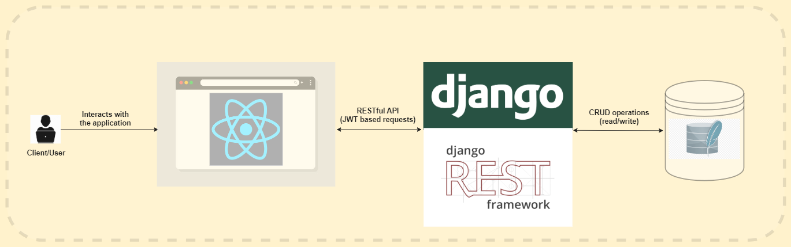

# Note It Down

## Table of contents
1. [Description](#description)
2. [Demo](#demo)
3. [Screenshots](#screenshots)
4. [Architecture Overview](#architecture-overview)
5. [API Documentation](#api-documentation)
6. [Installation and Usage](#installation-usage)

## Description 
It is a full-stack note-taking web application built with React on the frontend and Django/Django-Rest-Framework on the backend.

<ins>Features</ins>:
- Light/dark mode (depending on your device settings)
- Responsive layout
- JWT authentication
- Users:
  - Users can:
    - Signup/Login/Logout
    - Update their email & password
    - Delete their account
  - Currently loggedin user info is displayed on the home page
  
- Notes:
  - Users can:
    - Create a note
    - Set priority of a note
    - View all notes at once or filter notes by priority (high/medium/low)
    - View a specific note
    - Download/export a note as a pdf
    - Update/edit a note
    - Delete a note
  - A rich text editor is provided for taking down the notes

## Demo 
Check the video demo at [https://youtu.be/ME37aFqTa20](https://youtu.be/ME37aFqTa20)

## Screenshots 

## Architecture Overview 

## API Documentation 
All  the endpoints are listed below. However, to view the details of the endpoints, visit [Note It Down Api Docs](https://documenter.getpostman.com/view/25138891/2s8Z73xqLn).

- <ins>Users</ins>:
  - `api/users/all/` - GET
  - `api/users/user/` - GET, PUT, DELETE
  - `api/users/user/signup/` - POST
  - `api/users/user/login/token/` - POST
  - `api/users/user/login/token/refresh/` - POST
  - `api/users/bulkdelete/` - DELETE

- <ins>Notes</ins>:
  - `api/notes/all/` - GET
  - `api/notes/note/{noteId}/` - GET, PUT, DELETE 
  - `api/notes/note/` - POST
  - `api/notes/bulkdelete/` - DELETE

## Installation and Usage 
#### <ins>**General**</ins>
- Requirements:
  - `node >= 16.14.0`
  - `npm >= 8.3.1`
  - `python >= 3.8`
  - `pip >= 21.3.1`
- `git clone https://github.com/AI-14/note-it-down.git` - clones the repository
- `cd note-it-down`

#### <ins>**For backend folder**</ins>
- Setup the project as per *General* sub-section
- `cd backend`
- `py -m venv yourVenvName` - creates a virtual environment
- `yourVenvName\Scripts\activate.bat` - activates the virtual environment
- `pip install -r requirements.txt` - installs all modules
- `python manage.py makemigrations` & `python manage.py migrate` - migrates all the tables to db
- `python manage.py createsuperuser` - creates a superuser
- `python manage.py runserver` - runs the server
  
#### <ins>**For frontend folder**</ins>
- Setup the project as per *General* sub-section
- `cd frontend`
- `npm install` or `npm i` - installs all packages
- `npm install --save-dev` - installs devDependencies 
- `npm start` - starts the app

> NOTE: First run backend server (it will run on `http://127.0.0.1:8000`), then run frontend app (it will run on `http://127.0.0.1:3000`)

#### <ins>**Makefile**</ins>
You need to have `make` installed in your machine
- Setup the project as per *General* sub-section
- `make build-backend` - builds the backend
- `make build-frontend` - builds the frontend
- `make run-backend` - runs the backend
- `make run-frontend` - runs the frontend (make sure you open another cmd to run this command)
> NOTE: Use `make help` to see all the commands
