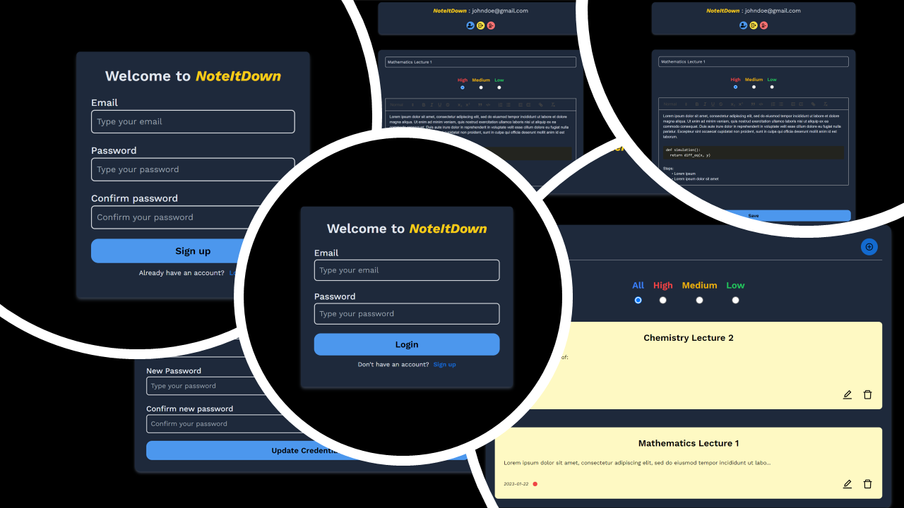

# Note It Down

## Description
It is a full-stack note-taking web application built with React on the frontend and Django/Django-Rest-Framework on the backend.

<ins>Features</ins>:
- Supports light/dark mode (depending on your device settings)
- For user credentials (JWT authentication based) i.e.
  - Users can Signup/Login/Logout
  - Currently loggedin user info is displayed on the home page
  - Users can update their email & password
  - Users can delete their account
- For notes (JWT authentication based) i.e.
  - Users can create a note
  - Users can set priority of a note
  - Users can update a note
  - Users can view all notes at once or filter notes by priority
  - Users can view a specific note & can download/export a note as a pdf
  - Users can delete a note
- A rich text editor is provided for taking down notes

## Demo
Check the video demo at [Note It Down Demo](https://youtu.be/ME37aFqTa20)

## Screenshots

## Architecture Overview 

> **<ins>Note to self</ins>:** _This section is meant to give an overview of how the frontend & backend are structured and how they communicate with each other. If refactoring or adding new features alter the architecture, change the pictures too via [draw.io](https://draw.io/) using the file `NoteItDown Architecture.drawio` in `readme-res` folder._

## API Documentation
View the api endpoints at [note-it-down-api-docs](https://documenter.getpostman.com/view/25138891/2s8Z73xqLn). I used postman for documenting the api endpoints.

## Installation And Usage
#### <ins>**General**</ins>
- Built on `OS: Windows 10` using `VSCode`
- Requirements:
  - `node >= 16.14.0`
  - `npm >= 8.3.1`
  - `python >= 3.8`
  - `pip >= 21.3.1`
- Download/clone this repository using `git clone https://github.com/AI-14/note-it-down.git`
- `cd note-it-down`
- NOTE: First run backend server (it will run on `http://127.0.0.1:8000`), then run frontend (it will run on `http://127.0.0.1:3000`)

#### <ins>**For frontend folder**</ins>
1. Installation  
   - Make sure you are in the project's directory. Then run the command `cd frontend`
   - Then install all dependencies by typing in the terminal `npm install` or `npm i`
   - To install devDependencies, type `npm install --save-dev`
   > **Note:** _If any dependency is missing or an error shows up regarding that *package*, install it using `npm install packageName`_

2. Usage
   - To start the project, type `npm start`

#### <ins>**For backend folder**</ins>
1. Installation
   - Make sure you are in the project's directory. Then run the command `cd backend`
   - Then create a virtual environment using the command `py -m venv yourVenvName` and activate it using `yourVenvName\Scripts\activate.bat`
   - Then run the following command `pip install -r requirements.txt`. With this, all the dependencies will be installed in your virtual environment
   - Then run the commands:
     - `python manage.py makemigrations`
     - `python manage.py migrate`
   > **Note:** _If any dependency is missing or an error shows up regarding that *module*, install it using `pip install moduleName`_

2. Usage
   - To start the project, type `python manage.py runserver`

#### <ins>**If using Makefile**</ins>
  - You need to have `make` installed in your machine. Then run the following commands in cmd:
  - `make build-backend`
  - `make build-frontend`
  - `make run-backend`
  - Then open another cmd and run `make run-frontend`
  - NOTE: use `make help` to see all the commands
